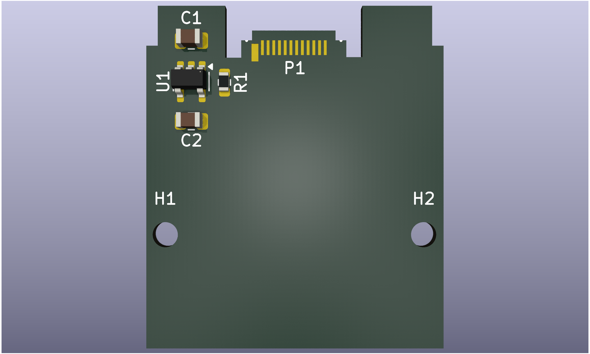

# Expansion-Card-TYPEC-950-ARP24
Framework Expansion Card template, with TYPEC-950-ARP24 (NextPCB's suggestion)

# License
[OG expansion card template](https://github.com/FrameworkComputer/ExpansionCards) designed by [Framework](https://frame.work). Derivative designed by: [Tan Siret Akıncı](https://github.com/tansiret).
Schematics and footprint are licensed with [CC BY 4.0](LICENSE).

